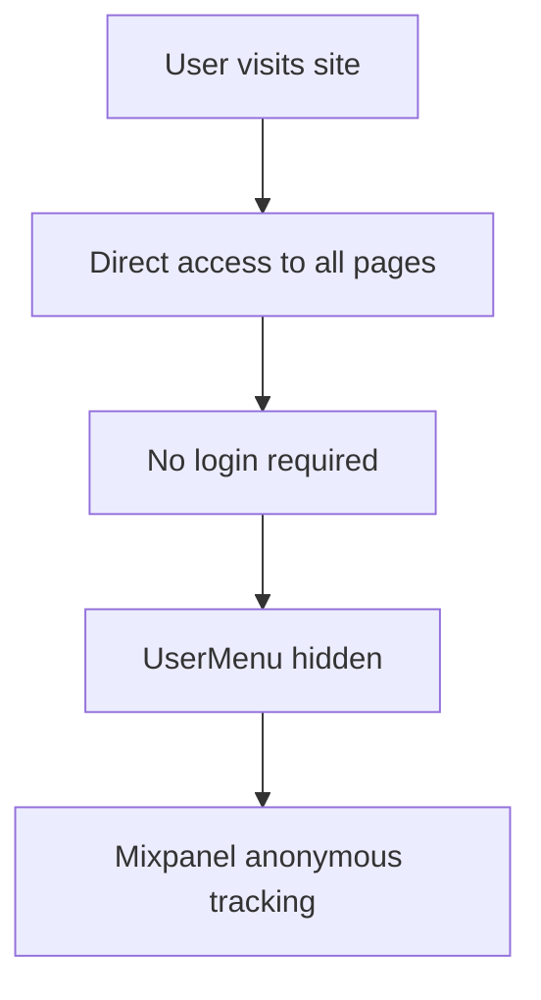

# Authentication System - Knowledge Base

## Overview

The AI Factory authentication system uses Supabase Auth with Google OAuth, integrated with Mixpanel for user tracking. The system supports a feature flag to enable/disable authentication entirely.

---

## Architecture

### Core Components

#### 1. Feature Flag System
**Location**: `lib/config/features.ts`

```typescript
export const FEATURES = {
  AUTH_ENABLED: process.env.NEXT_PUBLIC_ENABLE_AUTH === 'true',
} as const;
```

**Purpose**: Centralized configuration for toggling authentication on/off

**Default**: `false` (authentication disabled, public access)

#### 2. Authentication Provider
**Location**: `lib/auth.tsx`

**Responsibilities**:
- Manages user authentication state
- Handles Google OAuth login/logout
- Protects routes (when enabled)
- Integrates with Mixpanel for user tracking

**Key Logic**:
```typescript
// Skip auth if disabled
if (!FEATURES.AUTH_ENABLED) {
  setIsLoading(false);
  return; // No Supabase listener, no route protection
}

// Setup Supabase auth listener
supabase.auth.onAuthStateChange(...)

// Protect routes
if (!user && pathname !== "/login") {
  router.push("/login");
}
```

#### 3. User Interface
**Components**:
- `components/auth/UserMenu.tsx` - User menu with logout
- `app/login/page.tsx` - Login page with Google Auth button

**Conditional Rendering**:
```typescript
// UserMenu hides when auth is disabled
if (!FEATURES.AUTH_ENABLED) return null;

// Login page redirects when auth is disabled
if (!FEATURES.AUTH_ENABLED) {
  router.push("/");
}
```

---

## Authentication Flow

### When Auth is Enabled (`NEXT_PUBLIC_ENABLE_AUTH=true`)

```mermaid
graph TD
    A[User visits site] --> B{Authenticated?}
    B -->|No| C[Redirect to /login]
    C --> D[Click "Sign in with Google"]
    D --> E[Google OAuth Flow]
    E --> F[Supabase creates session]
    F --> G[Mixpanel identifies user]
    G --> H[Redirect to homepage]
    H --> I[UserMenu visible]
    
    B -->|Yes| H
```

### When Auth is Disabled (`NEXT_PUBLIC_ENABLE_AUTH=false`)



---

## Supabase Integration

### Configuration
**Environment Variables**:
```env
NEXT_PUBLIC_SUPABASE_URL=https://your-project.supabase.co
NEXT_PUBLIC_SUPABASE_ANON_KEY=your-anon-key
```

**Client Setup**: `lib/supabase.ts`
```typescript
import { createClient } from '@supabase/supabase-js';

export const supabase = createClient(
  process.env.NEXT_PUBLIC_SUPABASE_URL!,
  process.env.NEXT_PUBLIC_SUPABASE_ANON_KEY!
);
```

### OAuth Configuration
**Provider**: Google
**Redirect URL**: Dynamic based on hostname
- `conan.school` → `www.conan.school`
- Other domains → Same origin

---

## Mixpanel Integration

### User Identification
**When Auth Enabled**:
```typescript
const identifyMixpanel = (user: SupabaseUser) => {
  mixpanel.identify(user.id);
  mixpanel.people.set({
    $email: user.email,
    $name: user.user_metadata?.full_name,
    last_login: new Date().toISOString()
  });
};
```

**When Auth Disabled**:
- Anonymous tracking only
- No user identification
- `mixpanel.reset()` not called (no user to reset)

---

## Route Protection

### Protected Routes Logic
**Location**: `lib/auth.tsx` (useEffect hook)

```typescript
useEffect(() => {
  // Skip protection if auth disabled
  if (!FEATURES.AUTH_ENABLED) return;
  
  // Protect all routes except /login
  if (!user && pathname !== "/login") {
    router.push("/login");
  }
  
  // Redirect logged-in users away from login page
  if (user && pathname === "/login") {
    router.push("/");
  }
}, [user, isLoading, pathname, router]);
```

### Public Routes (Always Accessible)
- All routes when `AUTH_ENABLED=false`
- `/login` page (shows disabled message when auth is off)

---

## Feature Flag Toggle

### How to Disable Auth (Public Access)

1. **Update `.env.local`**:
   ```env
   NEXT_PUBLIC_ENABLE_AUTH=false
   ```

2. **Restart server**:
   ```bash
   npm run dev
   ```

3. **Verify**:
   - Homepage loads without login
   - UserMenu hidden
   - All pages accessible

### How to Enable Auth (Require Login)

1. **Update `.env.local`**:
   ```env
   NEXT_PUBLIC_ENABLE_AUTH=true
   NEXT_PUBLIC_SUPABASE_URL=your_url
   NEXT_PUBLIC_SUPABASE_ANON_KEY=your_key
   ```

2. **Restart server**:
   ```bash
   npm run dev
   ```

3. **Verify**:
   - Redirect to `/login` when not authenticated
   - Google Auth button works
   - UserMenu appears after login

---

## Troubleshooting

### Common Issues

#### 1. Auth Disabled But Still Redirecting
**Symptoms**: Homepage redirects to `/login` even with `AUTH_ENABLED=false`

**Causes**:
- Environment variable not loaded
- Server not restarted
- Typo in `.env.local`

**Solutions**:
1. Verify `.env.local` has `NEXT_PUBLIC_ENABLE_AUTH=false`
2. Completely stop and restart dev server
3. Check for typos (must be exact: `NEXT_PUBLIC_ENABLE_AUTH`)

#### 2. Login Fails When Auth Enabled
**Symptoms**: Google Auth button doesn't work or shows errors

**Causes**:
- Missing Supabase credentials
- Invalid Supabase URL/key
- OAuth not configured in Supabase

**Solutions**:
1. Verify `NEXT_PUBLIC_SUPABASE_URL` is set
2. Verify `NEXT_PUBLIC_SUPABASE_ANON_KEY` is set
3. Check Supabase dashboard → Authentication → Providers → Google
4. Ensure redirect URLs are configured in Supabase

#### 3. UserMenu Visible When Auth Disabled
**Symptoms**: User menu still shows even with auth disabled

**Causes**:
- Feature flag check missing
- Component not re-rendered
- Build cache issue

**Solutions**:
1. Check `UserMenu.tsx` has `if (!FEATURES.AUTH_ENABLED) return null;`
2. Clear `.next` cache: `rm -rf .next`
3. Rebuild: `npm run build`

---

## Files Reference

### Core Files
- [lib/config/features.ts](file:///Users/dac/ConanCode/conan.school%20websites/aifactory.conan.school/lib/config/features.ts) - Feature flags
- [lib/auth.tsx](file:///Users/dac/ConanCode/conan.school%20websites/aifactory.conan.school/lib/auth.tsx) - Auth provider
- [lib/supabase.ts](file:///Users/dac/ConanCode/conan.school%20websites/aifactory.conan.school/lib/supabase.ts) - Supabase client

### UI Components
- [components/auth/UserMenu.tsx](file:///Users/dac/ConanCode/conan.school%20websites/aifactory.conan.school/components/auth/UserMenu.tsx) - User menu
- [app/login/page.tsx](file:///Users/dac/ConanCode/conan.school%20websites/aifactory.conan.school/app/login/page.tsx) - Login page

### Configuration
- [.env.local.example](file:///Users/dac/ConanCode/conan.school%20websites/aifactory.conan.school/.env.local.example) - Environment template

### Documentation
- [.agent/workflows/auth_toggle.md](file:///Users/dac/ConanCode/conan.school%20websites/aifactory.conan.school/.agent/workflows/auth_toggle.md) - Toggle workflow
- [.agent/skills/auth_specialist/SKILL.md](file:///Users/dac/ConanCode/conan.school%20websites/aifactory.conan.school/.agent/skills/auth_specialist/SKILL.md) - Auth specialist skill

---

## Best Practices

1. **Default to Public Access**: Set `AUTH_ENABLED=false` by default for easier development
2. **Environment-Specific**: Use different values for dev/staging/production
3. **Document Changes**: Update this knowledge base when auth logic changes
4. **Test Both Modes**: Always test with auth enabled AND disabled before deploying
5. **Secure Credentials**: Never commit `.env.local` to git (already in `.gitignore`)
