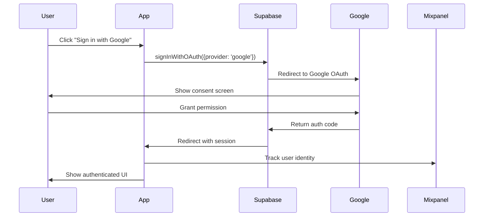

# Hướng Dẫn Tích Hợp Google Auth với Supabase

Tài liệu này hướng dẫn chi tiết cách tích hợp **Google Authentication** với **Supabase** cho ứng dụng Next.js, dựa trên implementation thực tế từ dự án `cd2.conan.school`.

---

## 📋 Mục Lục

1. [Tổng Quan Hệ Thống](#1-tổng-quan-hệ-thống)
2. [Cài Đặt & Cấu Hình](#2-cài-đặt--cấu-hình)
3. [Implementation Chi Tiết](#3-implementation-chi-tiết)
4. [Tính Năng Nâng Cao](#4-tính-năng-nâng-cao)
5. [Best Practices](#5-best-practices)
6. [Troubleshooting](#6-troubleshooting)

---

## 1. Tổng Quan Hệ Thống

### 1.1 Kiến Trúc Authentication

Hệ thống sử dụng:
- **Supabase Auth**: Backend authentication service
- **Google OAuth 2.0**: Identity provider
- **React Context API**: Client-side state management
- **Mixpanel**: Analytics tracking

### 1.2 Luồng Authentication



---

## 2. Cài Đặt & Cấu Hình

### 2.1 Dependencies

Cài đặt các package cần thiết:

```bash
npm install @supabase/supabase-js
npm install mixpanel-browser
```

### 2.2 Cấu Hình Supabase Dashboard

#### Bước 1: Tạo Supabase Project
1. Truy cập [Supabase Dashboard](https://supabase.com/dashboard)
2. Tạo project mới hoặc chọn project hiện có
3. Lưu lại **Project URL** và **Anon Key**

#### Bước 2: Cấu Hình Google OAuth Provider
1. Vào **Authentication** → **Providers**
2. Bật **Google** provider
3. Điền **Client ID** và **Client Secret** từ Google Cloud Console

#### Bước 3: Cấu Hình Redirect URLs
Vào **Authentication** → **URL Configuration**, thêm các URL sau:

```
https://cd2.conan.school/
https://www.conan.school/
http://localhost:3000/
```

> **Lưu ý**: Nếu bạn sử dụng nhiều subdomain, cần thêm tất cả vào danh sách.

### 2.3 Cấu Hình Google Cloud Console

#### Bước 1: Tạo OAuth 2.0 Credentials
1. Truy cập [Google Cloud Console](https://console.cloud.google.com/)
2. Chọn hoặc tạo project
3. Vào **APIs & Services** → **Credentials**
4. Click **Create Credentials** → **OAuth client ID**
5. Chọn **Web application**

#### Bước 2: Cấu Hình Authorized Redirect URIs
Thêm Supabase callback URL:

```
https://[YOUR-PROJECT-REF].supabase.co/auth/v1/callback
```

Ví dụ:
```
https://rillcjittbzmzwggyeyr.supabase.co/auth/v1/callback
```

#### Bước 3: Lấy Credentials
Copy **Client ID** và **Client Secret**, paste vào Supabase Dashboard (Bước 2.2)

### 2.4 Environment Variables

Tạo file `.env.local` trong root project:

```env
# Supabase Configuration
NEXT_PUBLIC_SUPABASE_URL=https://rillcjittbzmzwggyeyr.supabase.co
NEXT_PUBLIC_SUPABASE_ANON_KEY=sb_publishable__GNuRyKp_8FIb4Zr6aMpjg_kjNJ2ZlB

# Mixpanel Configuration (Optional)
NEXT_PUBLIC_MIXPANEL_TOKEN=your_mixpanel_token_here
```

> **⚠️ Bảo Mật**: Không commit file `.env.local` vào Git. Thêm vào `.gitignore`.

---

## 3. Implementation Chi Tiết

### 3.1 Supabase Client Setup

Tạo file `lib/supabase.ts`:

```typescript
import { createClient } from '@supabase/supabase-js';

const getSupabaseUrl = () => {
    const url = process.env.NEXT_PUBLIC_SUPABASE_URL;
    if (url && (url.startsWith('https://') || url.startsWith('http://'))) {
        return url;
    }
    return 'https://placeholder.supabase.co'; // Fallback to prevent crash
};

const supabaseUrl = getSupabaseUrl();
const supabaseKey = process.env.NEXT_PUBLIC_SUPABASE_ANON_KEY || 'placeholder-key';

export const supabase = createClient(supabaseUrl, supabaseKey);
```

**Giải thích**:
- `getSupabaseUrl()`: Validate URL format để tránh lỗi runtime
- Fallback values: Đảm bảo app không crash khi thiếu env variables

### 3.2 Auth Context Provider

Tạo file `lib/auth.tsx`:

```typescript
"use client";

import React, { createContext, useContext, useState, useEffect } from "react";
import { useRouter, usePathname } from "next/navigation";
import mixpanel from "mixpanel-browser";
import { supabase } from "./supabase";
import { User as SupabaseUser } from "@supabase/supabase-js";

interface AuthContextType {
    user: SupabaseUser | null;
    login: () => void;
    logout: () => void;
    isLoading: boolean;
}

const AuthContext = createContext<AuthContextType | undefined>(undefined);

export function AuthProvider({ children }: { children: React.ReactNode }) {
    const [user, setUser] = useState<SupabaseUser | null>(null);
    const [isLoading, setIsLoading] = useState(true);
    const router = useRouter();
    const pathname = usePathname();

    // Listen to auth state changes
    useEffect(() => {
        let mounted = true;

        const { data: { subscription } } = supabase.auth.onAuthStateChange(
            async (_event, session) => {
                if (mounted) {
                    if (session?.user) {
                        setUser(session.user);
                        identifyMixpanel(session.user);
                    } else {
                        setUser(null);
                        mixpanel.reset();
                    }
                    setIsLoading(false);
                }
            }
        );

        return () => {
            mounted = false;
            subscription.unsubscribe();
        };
    }, []);

    // Mixpanel tracking
    const identifyMixpanel = (user: SupabaseUser) => {
        mixpanel.identify(user.id);
        mixpanel.people.set({
            $email: user.email,
            $name: user.user_metadata?.full_name || user.user_metadata?.name || user.email,
            last_login: new Date().toISOString()
        });
    };

    // Route protection
    useEffect(() => {
        if (!isLoading) {
            if (!user && pathname !== "/login") {
                router.push("/login");
            } else if (user && pathname === "/login") {
                router.push("/");
            }
        }
    }, [user, isLoading, pathname, router]);

    // Login function
    const login = async () => {
        const getRedirectUrl = () => {
            const hostname = window.location.hostname;
            const protocol = window.location.protocol;

            // If logging in from root domain "conan.school", redirect to "www.conan.school"
            if (hostname === 'conan.school') {
                return `${protocol}//www.conan.school/`;
            }

            // Otherwise (cd2.conan.school, localhost, etc.), stay on current origin
            return `${window.location.origin}/`;
        };

        const { error } = await supabase.auth.signInWithOAuth({
            provider: 'google',
            options: {
                redirectTo: getRedirectUrl(),
            }
        });
        
        if (error) {
            console.error("Login error:", error);
            mixpanel.track("Login Error", { error: error.message });
        }
    };

    // Logout function
    const logout = async () => {
        try {
            const { error } = await supabase.auth.signOut();
            if (error) {
                console.error("Logout error:", error);
            }
        } catch (e) {
            console.error("Unexpected logout error:", e);
        } finally {
            // Always clear local state and redirect
            setUser(null);
            mixpanel.reset();
            router.push("/login");
            router.refresh();
        }
    };

    return (
        <AuthContext.Provider value={{ user, login, logout, isLoading }}>
            {isLoading ? (
                <div style={{
                    height: "100vh",
                    display: "flex",
                    alignItems: "center",
                    justifyContent: "center",
                    backgroundColor: "hsl(var(--background))",
                    color: "hsl(var(--foreground))"
                }}>
                    Loading...
                </div>
            ) : (
                children
            )}
        </AuthContext.Provider>
    );
}

export function useAuth() {
    const context = useContext(AuthContext);
    if (context === undefined) {
        throw new Error("useAuth must be used within an AuthProvider");
    }
    return context;
}
```

**Các tính năng chính**:
1. **Auth State Management**: Tự động sync với Supabase session
2. **Route Protection**: Redirect unauthenticated users to `/login`
3. **Mixpanel Integration**: Track user identity và login events
4. **Smart Redirect**: Handle multiple domains (root vs subdomain)
5. **Loading State**: Prevent flash of unauthenticated content

### 3.3 Root Layout Integration

Cập nhật `app/layout.tsx`:

```typescript
import type { Metadata } from "next";
import { AuthProvider } from "@/lib/auth";
import Navbar from "@/components/ui/Navbar";
import Footer from "@/components/ui/Footer";
import { Toaster } from "sonner";
import "./globals.css";
import MixpanelScript from "@/components/analytics/MixpanelScript";

export default function RootLayout({
  children,
}: {
  children: React.ReactNode;
}) {
  return (
    <html lang="vi">
      <head>
        <MixpanelScript />
      </head>
      <body style={{ display: 'flex', flexDirection: 'column', minHeight: '100vh' }}>
        <AuthProvider>
          <Navbar />
          <main style={{ flex: 1, padding: '2rem 0' }}>
            {children}
          </main>
          <Footer />
          <Toaster position="top-center" richColors />
        </AuthProvider>
      </body>
    </html>
  );
}
```

### 3.4 Login Page

Tạo file `app/login/page.tsx`:

```typescript
"use client";

import React from "react";
import { useAuth } from "@/lib/auth";
import { Card, CardContent, CardHeader, CardTitle, CardDescription } from "@/components/ui/Card";
import { Lock } from "lucide-react";

export default function LoginPage() {
    const { login } = useAuth();

    const handleGoogleLogin = () => {
        login();
    };

    return (
        <div style={{
            minHeight: "100vh",
            display: "flex",
            alignItems: "center",
            justifyContent: "center",
            backgroundColor: "hsl(var(--background))",
            padding: "1rem"
        }}>
            <Card style={{ width: "100%", maxWidth: "400px" }}>
                <CardHeader style={{ textAlign: "center" }}>
                    <div style={{
                        margin: "0 auto 1rem",
                        width: "3rem",
                        height: "3rem",
                        backgroundColor: "hsl(var(--primary) / 0.1)",
                        borderRadius: "50%",
                        display: "flex",
                        alignItems: "center",
                        justifyContent: "center",
                        color: "hsl(var(--primary))"
                    }}>
                        <Lock size={24} />
                    </div>
                    <CardTitle>Đăng nhập</CardTitle>
                    <CardDescription>Đăng nhập bằng tài khoản Google để tiếp tục.</CardDescription>
                </CardHeader>
                <CardContent>
                    <button
                        onClick={handleGoogleLogin}
                        style={{
                            width: "100%",
                            padding: "0.75rem",
                            backgroundColor: "hsl(var(--primary))",
                            color: "white",
                            border: "none",
                            borderRadius: "0.375rem",
                            fontWeight: 500,
                            cursor: "pointer",
                            display: "flex",
                            alignItems: "center",
                            justifyContent: "center",
                            gap: "0.5rem"
                        }}
                    >
                        <svg className="w-5 h-5" viewBox="0 0 24 24" width="20" height="20">
                            <path
                                d="M22.56 12.25c0-.78-.07-1.53-.2-2.25H12v4.26h5.92c-.26 1.37-1.04 2.53-2.21 3.31v2.77h3.57c2.08-1.92 3.28-4.74 3.28-8.09z"
                                fill="#4285F4"
                            />
                            <path
                                d="M12 23c2.97 0 5.46-.98 7.28-2.66l-3.57-2.77c-.98.66-2.23 1.06-3.71 1.06-2.86 0-5.29-1.93-6.16-4.53H2.18v2.84C3.99 20.53 7.7 23 12 23z"
                                fill="#34A853"
                            />
                            <path
                                d="M5.84 14.09c-.22-.66-.35-1.36-.35-2.09s.13-1.43.35-2.09V7.07H2.18C1.43 8.55 1 10.22 1 12s.43 3.45 1.18 4.93l2.85-2.22.81-.62z"
                                fill="#FBBC05"
                            />
                            <path
                                d="M12 5.38c1.62 0 3.06.56 4.21 1.64l3.15-3.15C17.45 2.09 14.97 1 12 1 7.7 1 3.99 3.47 2.18 7.07l3.66 2.84c.87-2.6 3.3-4.53 6.16-4.53z"
                                fill="#EA4335"
                            />
                        </svg>
                        Sign in with Google
                    </button>
                </CardContent>
            </Card>
        </div>
    );
}
```

### 3.5 User Menu Component

Tạo file `components/auth/UserMenu.tsx`:

```typescript
"use client";

import React from "react";
import { useAuth } from "@/lib/auth";
import { User, LogOut } from "lucide-react";
import { Popover, PopoverContent, PopoverTrigger } from "@/components/ui/Popover";

export default function UserMenu() {
    const { user, logout } = useAuth();

    if (!user) return null;

    const fullName = user.user_metadata?.full_name || user.user_metadata?.name || user.email?.split('@')[0] || "User";
    const avatarUrl = user.user_metadata?.avatar_url || user.user_metadata?.picture;
    const firstName = user.user_metadata?.given_name || fullName.split(' ').pop();

    return (
        <Popover>
            <PopoverTrigger>
                <div style={{
                    display: "flex",
                    alignItems: "center",
                    gap: "0.5rem",
                    padding: "0.25rem 0.75rem 0.25rem 0.25rem",
                    borderRadius: "999px",
                    backgroundColor: "hsl(var(--secondary))",
                    cursor: "pointer",
                    fontSize: "0.875rem",
                    fontWeight: 500,
                    border: "1px solid hsl(var(--border))"
                }}>
                    {avatarUrl ? (
                        
                    ) : (
                        <div style={{ width: "24px", height: "24px", borderRadius: "50%", backgroundColor: "hsl(var(--primary))", display: "flex", alignItems: "center", justifyContent: "center", color: "white", fontSize: "12px" }}>
                            {firstName?.[0]?.toUpperCase()}
                        </div>
                    )}
                    {firstName}
                </div>
            </PopoverTrigger>
            <PopoverContent>
                <div style={{ display: "flex", flexDirection: "column", gap: "1rem", minWidth: "250px" }}>
                    <div style={{ borderBottom: "1px solid hsl(var(--border))", paddingBottom: "0.5rem", display: "flex", gap: "0.75rem", alignItems: "center" }}>
                        {avatarUrl ? (
                            
                        ) : (
                            <div style={{ width: "40px", height: "40px", borderRadius: "50%", backgroundColor: "hsl(var(--primary))", display: "flex", alignItems: "center", justifyContent: "center", color: "white", fontSize: "16px" }}>
                                {fullName?.[0]?.toUpperCase()}
                            </div>
                        )}
                        <div>
                            <p style={{ fontWeight: 600 }}>{fullName}</p>
                            <p style={{ fontSize: "0.75rem", color: "hsl(var(--muted-foreground))" }}>{user.email}</p>
                        </div>
                    </div>
                    <button
                        onClick={logout}
                        style={{
                            display: "flex",
                            alignItems: "center",
                            gap: "0.5rem",
                            background: "none",
                            border: "none",
                            cursor: "pointer",
                            padding: "0.5rem 0",
                            color: "hsl(var(--destructive))",
                            fontSize: "0.875rem"
                        }}
                    >
                        <LogOut size={16} /> Logout
                    </button>
                </div>
            </PopoverContent>
        </Popover>
    );
}
```

**Tính năng**:
- Hiển thị avatar từ Google profile
- Fallback to initials nếu không có avatar
- Dropdown menu với thông tin user
- Logout button

---

## 4. Tính Năng Nâng Cao

### 4.1 Protected Sections (Role-Based Access Control)

Tạo file `lib/access-control.ts`:

```typescript
export const ADMIN_EMAIL = 'dac2205@gmail.com';

/**
 * Check if a user has access to a protected section
 * @param userEmail - The email of the current user
 * @param section - The section being accessed (jtbd, audience, insights, quiz)
 * @returns true if user has access, false otherwise
 */
export function canAccessProtectedSection(
    userEmail: string | undefined,
    section: string
): boolean {
    const protectedSections = ['insights', 'audience'];

    // Public sections are always accessible
    if (!protectedSections.includes(section)) {
        return true;
    }

    // Protected sections require admin email
    return userEmail === ADMIN_EMAIL;
}
```

Tạo component `components/auth/ProtectedSection.tsx`:

```typescript
"use client";

import React from "react";
import { useAuth } from "@/lib/auth";
import { canAccessProtectedSection } from "@/lib/access-control";
import { Lock } from "lucide-react";

interface ProtectedSectionProps {
    section: string;
    children: React.ReactNode;
}

export default function ProtectedSection({ section, children }: ProtectedSectionProps) {
    const { user, isLoading, login } = useAuth();

    // Show loading state
    if (isLoading) {
        return (
            <div style={{
                textAlign: "center",
                padding: "3rem",
                color: "hsl(var(--ink-brown) / 0.6)"
            }}>
                <p>Loading...</p>
            </div>
        );
    }

    // Check access
    const hasAccess = canAccessProtectedSection(user?.email, section);

    if (!hasAccess) {
        return (
            <div className="card-wood" style={{
                textAlign: "center",
                padding: "3rem",
                maxWidth: "500px",
                margin: "2rem auto"
            }}>
                <div style={{
                    display: "flex",
                    justifyContent: "center",
                    marginBottom: "1.5rem"
                }}>
                    <Lock size={48} style={{ color: "hsl(var(--ink-brown) / 0.4)" }} />
                </div>
                <h2 style={{
                    fontSize: "1.75rem",
                    marginBottom: "1rem",
                    color: "hsl(var(--ink-brown))"
                }}>
                    Protected Content
                </h2>
                <p style={{
                    fontSize: "1.125rem",
                    marginBottom: "1.5rem",
                    color: "hsl(var(--ink-brown) / 0.7)"
                }}>
                    This section is restricted to authorized users only.
                </p>

                {!user ? (
                    <button
                        onClick={login}
                        style={{
                            padding: "0.75rem 1.5rem",
                            fontSize: "1rem",
                            fontWeight: "600",
                            color: "hsl(var(--paper-white))",
                            backgroundColor: "hsl(var(--primary))",
                            border: "none",
                            borderRadius: "8px",
                            cursor: "pointer",
                            transition: "all 0.2s ease"
                        }}
                        className="hover-warm-glow"
                    >
                        Sign in to access
                    </button>
                ) : (
                    <p style={{
                        fontSize: "1rem",
                        color: "hsl(var(--ink-brown) / 0.6)",
                        fontStyle: "italic"
                    }}>
                        Your account ({user.email}) does not have access to this section.
                    </p>
                )}
            </div>
        );
    }

    return <>{children}</>;
}
```

**Cách sử dụng**:

```typescript
import ProtectedSection from "@/components/auth/ProtectedSection";

export default function InsightsPage() {
    return (
        <ProtectedSection section="insights">
            <h1>Protected Insights Content</h1>
            {/* Your protected content here */}
        </ProtectedSection>
    );
}
```

### 4.2 Shared Authentication Across Subdomains

Để share session giữa `cd2.conan.school` và `www.conan.school`, cần custom storage provider.

Cập nhật `lib/supabase.ts`:

```typescript
import { createClient } from '@supabase/supabase-js';

const getSupabaseUrl = () => {
    const url = process.env.NEXT_PUBLIC_SUPABASE_URL;
    if (url && (url.startsWith('https://') || url.startsWith('http://'))) {
        return url;
    }
    return 'https://placeholder.supabase.co';
};

const supabaseUrl = getSupabaseUrl();
const supabaseKey = process.env.NEXT_PUBLIC_SUPABASE_ANON_KEY || 'placeholder-key';

// Custom Cookie Storage Provider for Subdomain Sharing
const cookieStorage = {
    getItem: (key: string) => {
        if (typeof document === 'undefined') return null;
        const match = document.cookie.match(new RegExp('(^| )' + key + '=([^;]+)'));
        return match ? decodeURIComponent(match[2]) : null;
    },
    setItem: (key: string, value: string) => {
        if (typeof document === 'undefined') return;
        // Set cookie for parent domain .conan.school if on subdomain
        const hostname = window.location.hostname;
        let domainStr = '';
        if (hostname.endsWith('.conan.school')) {
            domainStr = '; domain=.conan.school'; 
        }
        // Set cookie for 1 year, SameSite=Lax to share across subdomains
        document.cookie = `${key}=${encodeURIComponent(value)}${domainStr}; path=/; max-age=31536000; SameSite=Lax; Secure`;
    },
    removeItem: (key: string) => {
        if (typeof document === 'undefined') return;
        const hostname = window.location.hostname;
        let domainStr = '';
        if (hostname.endsWith('.conan.school')) {
            domainStr = '; domain=.conan.school';
        }
        document.cookie = `${key}=; path=/; expires=Thu, 01 Jan 1970 00:00:01 GMT${domainStr}; SameSite=Lax; Secure`;
    }
};

export const supabase = createClient(supabaseUrl, supabaseKey, {
    auth: {
        storage: cookieStorage, // Use custom storage
        autoRefreshToken: true,
        persistSession: true,
        detectSessionInUrl: true
    }
});
```

**Lưu ý**:
- Cookie sẽ được set cho domain `.conan.school`
- Cả `cd2.conan.school` và `www.conan.school` đều đọc được
- Cần thêm cả 2 domain vào Supabase Redirect URLs

### 4.3 Mixpanel Analytics Integration

Tạo file `components/analytics/MixpanelScript.tsx`:

```typescript
"use client";

import { useEffect } from "react";
import mixpanel from "mixpanel-browser";

export default function MixpanelScript() {
    useEffect(() => {
        const token = process.env.NEXT_PUBLIC_MIXPANEL_TOKEN;
        if (token) {
            mixpanel.init(token, {
                debug: process.env.NODE_ENV === "development",
                track_pageview: true,
                persistence: "localStorage"
            });
        }
    }, []);

    return null;
}
```

**Tracking Events**:

```typescript
// Track custom events
mixpanel.track("Button Clicked", {
    button_name: "Sign Up",
    page: "/pricing"
});

// Track page views
mixpanel.track_pageview({
    page: window.location.pathname
});
```

---

## 5. Best Practices

### 5.1 Security

✅ **DO**:
- Luôn validate environment variables
- Sử dụng `httpOnly` cookies cho production
- Implement CSRF protection
- Sanitize user input
- Use `Secure` flag cho cookies trong production

❌ **DON'T**:
- Không lưu sensitive data trong localStorage
- Không expose API keys trong client code
- Không trust client-side validation alone

### 5.2 Performance

✅ **Optimizations**:
- Lazy load authentication components
- Cache user data appropriately
- Minimize re-renders with `useMemo` và `useCallback`
- Use React Context efficiently

### 5.3 User Experience

✅ **Best Practices**:
- Show loading states during authentication
- Provide clear error messages
- Implement auto-redirect after login
- Remember user's intended destination
- Graceful fallbacks for failed auth

### 5.4 Testing

```typescript
// Example test for auth context
import { render, screen, waitFor } from '@testing-library/react';
import { AuthProvider, useAuth } from '@/lib/auth';

describe('AuthProvider', () => {
    it('should provide user context', async () => {
        const TestComponent = () => {
            const { user, isLoading } = useAuth();
            return <div>{isLoading ? 'Loading' : user?.email}</div>;
        };

        render(
            <AuthProvider>
                <TestComponent />
            </AuthProvider>
        );

        await waitFor(() => {
            expect(screen.queryByText('Loading')).not.toBeInTheDocument();
        });
    });
});
```

---

## 6. Troubleshooting

### 6.1 Common Issues

#### Issue: "Invalid redirect URL"
**Solution**: Đảm bảo URL đã được thêm vào Supabase Dashboard → Authentication → URL Configuration

#### Issue: User không được redirect sau khi login
**Solution**: 
1. Kiểm tra `redirectTo` URL trong `signInWithOAuth`
2. Verify Google Cloud Console Authorized Redirect URIs
3. Check browser console for errors

#### Issue: Session không persist sau refresh
**Solution**:
1. Verify `persistSession: true` trong Supabase client config
2. Check browser cookies (DevTools → Application → Cookies)
3. Ensure `autoRefreshToken: true`

#### Issue: CORS errors
**Solution**:
1. Verify Supabase project URL
2. Check if domain is whitelisted in Supabase
3. Ensure proper headers in API routes

### 6.2 Debug Mode

Enable debug logging:

```typescript
// In lib/supabase.ts
export const supabase = createClient(supabaseUrl, supabaseKey, {
    auth: {
        debug: process.env.NODE_ENV === 'development',
        // ... other options
    }
});
```

### 6.3 Monitoring

Track authentication metrics:

```typescript
// Track login success
mixpanel.track("Login Success", {
    provider: "google",
    timestamp: new Date().toISOString()
});

// Track login failures
mixpanel.track("Login Error", {
    error: error.message,
    provider: "google"
});
```

---

## 📚 Tài Liệu Tham Khảo

- [Supabase Auth Documentation](https://supabase.com/docs/guides/auth)
- [Google OAuth 2.0 Documentation](https://developers.google.com/identity/protocols/oauth2)
- [Next.js Authentication Patterns](https://nextjs.org/docs/authentication)
- [Mixpanel JavaScript SDK](https://developer.mixpanel.com/docs/javascript)

---

## 🔄 Version History

- **v1.0** (2026-01-27): Initial documentation
  - Basic Google Auth + Supabase integration
  - Protected sections with RBAC
  - Subdomain session sharing
  - Mixpanel analytics integration

---

**Tác giả**: Conan School Development Team  
**Cập nhật lần cuối**: 2026-01-27
